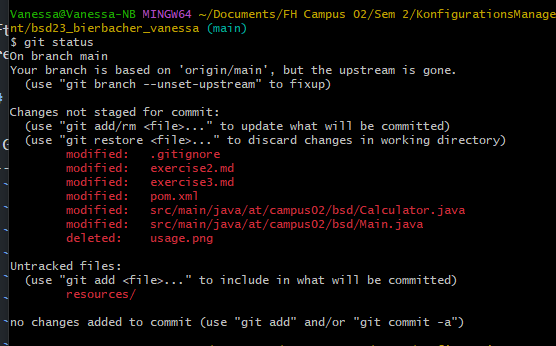

# Exercise 2

Downloading Git and creating a new Git Hub Account. First Commits and Pushes.

### .gitognire File

After adding exercise1.pdf & exercise2.pdf to the gitognire file, the files aren't listet anymore in the changes not filed for commit anymore.

## Git Commands

| Git Command  | Description                                        |
|--------------|----------------------------------------------------|
| `git config` | Sets configuration options.                        |
| `git init`   | Initializes a new Git repository.                  |
| `git commit` | Records staged changes to the repository.          |
| `git status` | Shows the status of working directory and staging area. |
| `git add`    | Adds file changes to the staging area.             |
| `git log`    | Displays the commit history.                       |
| `git diff`   | Shows changes between commits, branches, etc.      |
| `git pull`   | Fetches changes from a remote repository and merges them into the local branch. |
| `git push`   | Sends committed changes to a remote repository.    |

