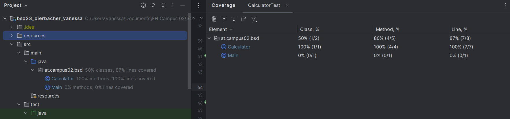

# Exercise 4

## Testcases Calculator

### ```add()```

- positive values
- negative values
- double values

### ```minus()```

- positive values
- negative values
- first one smaller than second

### ```multiply()```

- positive values
- negative values
- 0

### ```divide()```

- positive values
- first one smaller than second (0. answer)
- divide by 0

## Test Coverage



## Test Faculty without implementation


